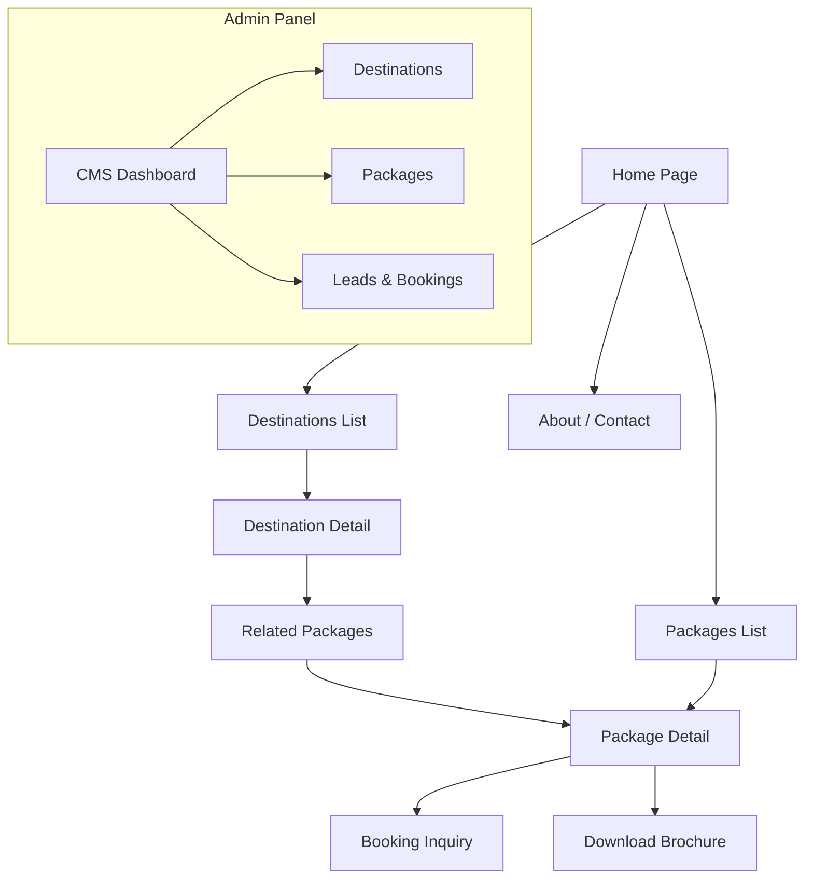
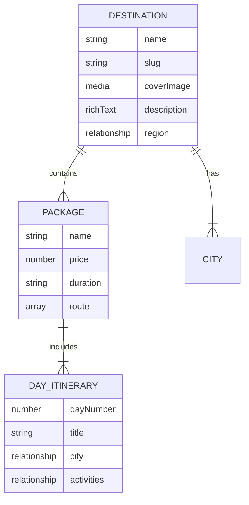

# Lets Tour 🌍✈️

A premium travel agency platform built with **Next.js 15 (App Router)** and **Payload CMS 3.0**. This application features dynamic travel packages, destination guides, and a robust admin panel for content management, all delivered with high-performance animations and SEO optimization.

## 🚀 Tech Stack

- **Framework:** [Next.js 15](https://nextjs.org/) (App Router, Server Components)
- **CMS:** [Payload CMS 3.0](https://payloadcms.com/) (Headless, TypeScript-first)
- **Database:** MongoDB
- **Styling:** Tailwind CSS, Shadcn UI
- **Email:** Nodemailer (Zoho SMTP with Payload Adapter)
- **Animations:** Custom CSS & Tailwind (Global Preloader, Smooth Transitions)

## ✨ Key Features

### 🎨 Frontend Experience
- **Dynamic Preloader:** A custom "Plane Journey" animation that entertains users during route transitions, featuring cycling travel themes (e.g., "Packing bags...", "Fueling jet...").
- **Immersive Destination Pages:** High-quality image carousels with eager loading and smooth transitions.
- **Rich Content:** Travel packages and destination guides rendered with Lexical RichText support.
- **Responsive Design:** Fully optimized for mobile, tablet, and desktop views.

### 🛠️ Backend & Admin
- **Content Management:** Manage Destinations, Packages, Inclusions/Exclusions, and Global Settings (Header/Footer/Theme) easily via the Admin Panel.
- **Email Notifications:** Automated emails for new leads and bookings using Zoho Mail SMTP.
- **SEO Ready:** Built-in SEO plugin for managing metadata, Open Graph tags, and sitemaps.
- **Live Preview:** Real-time content preview before publishing.

## 🛠️ Getting Started

### Prerequisites
- Node.js 18.20.2+ or >=20.9.0
- pnpm (recommended) or npm
- MongoDB (Local or Atlas URL)

### Installation

1.  **Clone the repository:**
    ```bash
    git clone <repository-url>
    cd Lets-Tour
    ```

2.  **Install dependencies:**
    ```bash
    pnpm install
    # or
    npm install
    ```

3.  **Environment Setup:**
    Duplicate the example env file and configure your keys.
    ```bash
    cp .env.example .env
    ```

    **Critical Variables:**
    - `MONGODB_URI`: Your MongoDB connection string.
    - `PAYLOAD_SECRET`: A random string for session security.
    - `ZOHO_USER` & `ZOHO_PASS`: SMTP credentials for email sending (Use App Password for Zoho).
    - `NEXT_PUBLIC_SERVER_URL`: URL of your server (e.g., `http://localhost:3000`).

4.  **Run Development Server:**
    ```bash
    pnpm dev
    ```
    - Website: [http://localhost:3000](http://localhost:3000)
    - Admin Panel: [http://localhost:3000/admin](http://localhost:3000/admin)

### 📧 Email Configuration (Zoho)

This project uses the `@payloadcms/email-nodemailer` adapter.
1.  Ensure `ZOHO_USER` (email) and `ZOHO_PASS` (App Password) are set in `.env`.
2.  Test the configuration by visiting `http://localhost:3000/api/test-email` in your browser.

## 📂 Project Structure

```
src/
├── app/                # Next.js App Router (Frontend)
│   ├── (frontend)/     # Public facing pages
│   ├── (payload)/      # Admin panel routes
│   └── api/            # API routes (test-email, etc.)
├── blocks/             # Reusable UI Blocks (Hero, Carousels, Forms)
├── collections/        # Payload CMS Collection Definitions
│   ├── Packages.ts     
│   ├── Destinations.ts
│   └── ...
├── components/         # React Components (GlobalPreloader, UI elements)
├── globals/            # Global Settings (Header, Footer)
└── payload.config.ts   # Main Payload Configuration
```

## 📜 Scripts

- `pnpm dev`: Start the development server.
- `pnpm build`: Build the application for production.
- `pnpm start`: Start the production server.
- `pnpm generate:types`: Regenerate TypeScript types from Payload collections.
- `pnpm lint`:/`pnpm lint:fix`: Run ESLint.

## 🤝 Contributing

1.  Create a feature branch (`git checkout -b feature/amazing-feature`).
2.  Commit your changes (`git commit -m 'Add amazing feature'`).
3.  Push to the branch (`git push origin feature/amazing-feature`).
4.  Open a Pull Request.


## 🏗️ Architecture & Usage

### Site Hierarchy
The following diagram illustrates the user navigation flow and page structure.



### Data Logical Flow
How content is structured in Payload CMS and serves the frontend.



### Key Data Concepts

1.  **Destinations:** The root entity (e.g., "France", "Bali"). Contains broad information, cultural vibes, and linked cities.
2.  **Packages:** Curated trips linked to one or more Destinations. Each package has a day-wise itinerary, pricing, and specific inclusions.
3.  **Global Settings:** Header navigation, Footer links, and Site-wide themes are managed securely in the Globals section of the CMS.

---
Built with ❤️ by **Heptre Techworks**
