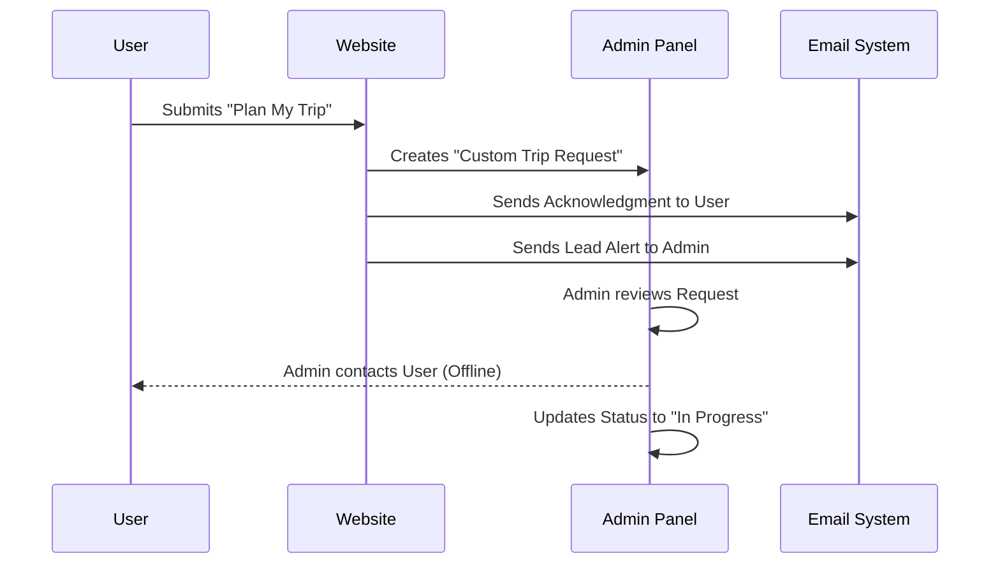
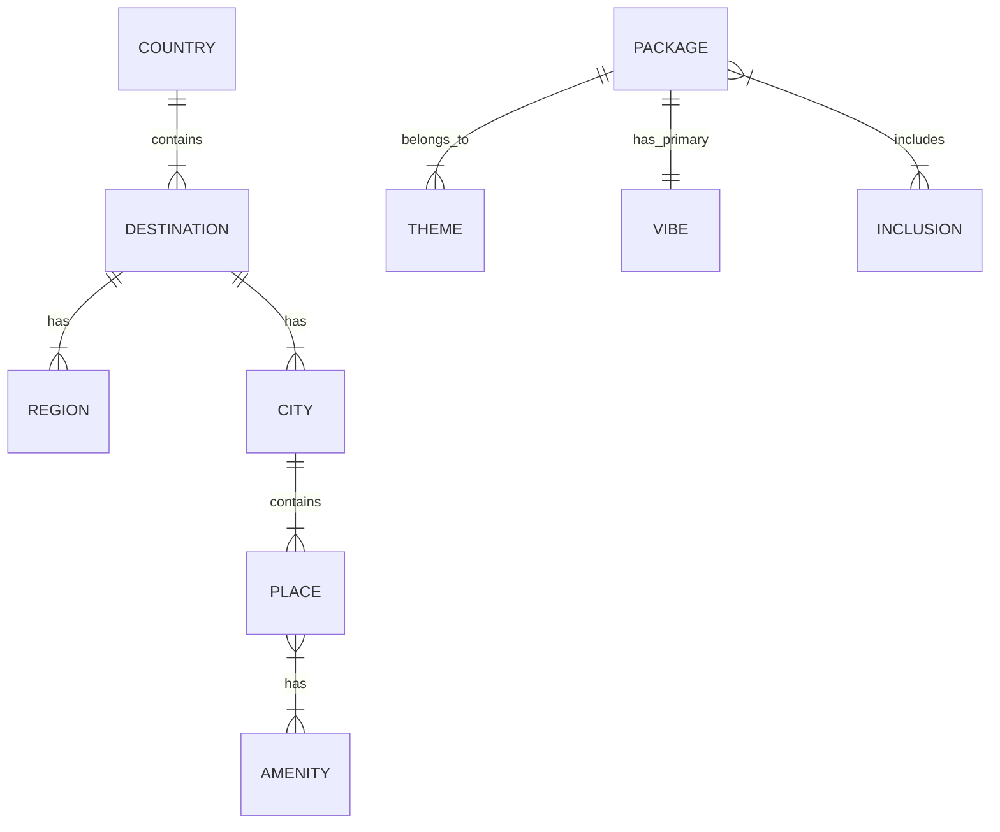

# Admin Panel User Guide

Welcome to the **Lets Tour Admin Panel**. This specific guide is designed to help you navigate the content management system, create stunning travel pages, and manage trip requests efficiently.

## 1. Dashboard Overview

Upon logging in, you are greeted by the **Travel Management Status** dashboard. This provides a quick snapshot of your site's data:

-   **Packages**: Total number of travel packages available.
-   **Destinations**: Active destinations showcased.
-   **Places**: Attractions and points of interest across all destinations.
-   **Bookings**: Direct booking requests waiting for action.
-   **Custom Trips**: "Curate My Trip" requests.
-   **Reviews**: User-submitted reviews (pending approval).

**Quick Actions**: Use the **+ Create New** button on any card to immediately start adding content.

---

## 2. Content Hierarchy & Workflow

To build a rich travel website, it is best to follow this hierarchy when adding content:

### Step 1: Destination (The Foundation)
**Navigation**: `Travel Management > Destinations`
-   Create a **Destination** first (e.g., "Kashmir", "Bali").
-   **Key Fields**:
    -   `Name` & `Slug` (URL).
    -   `Continent` & `Country`.
    -   `Hero Images`: Used for the top banner.

### Step 2: Places (The Attractions)
**Navigation**: `Travel Management > Places`
-   Create **Places** (e.g., "Dal Lake", "Gulmarg Gondola") and assign them to a **Destination**.
-   **Important**: These places will automatically appear on the Destination page under "Things to Do".

### Step 3: Packages (The Product)
**Navigation**: `Travel Management > Packages`
-   Create a **Package** (e.g., "Magical Kashmir 5N/6D").
-   **Key Connections**:
    -   **Destination**: Link it to "Kashmir".
    -   **Themes**: Select themes like "Honeymoon", "Adventure". (Packages can belong to multiple themes!).
    -   **Vibe**: Select a primary vibe.
    -   `Itinerary`: Add daily schedules linking to the **Places** you created in Step 2.

### Visual Hierarchy

```mermaid
graph TD
    D[Destination<br/>(e.g., Kashmir)] --> R[Region/City<br/>(e.g., Gulmarg)]
    R --> P[Place<br/>(e.g., Gondola)]
    MA[Main Content Flow] -.-> P
    
    PKG[Package<br/>(e.g., Magical Kashmir)] --> D
    PKG --> T[Theme<br/>(e.g., Adventure)]
    PKG --> V[Vibe<br/>(e.g., Chill)]
    PKG -- Includes --> P
```

---

## 3. Page Building (Visual Editor)

**Navigation**: `Site Management > Pages`

We use a "Block-Based" builder for pages like Home, About, or custom landing pages.

### Key Blocks
-   **Hero**: Main top banner.
-   **Dynamic Scroller (Important!)**:
    -   This is the engine for listing content.
    -   **Package Section**: Select "Auto" to show packages related to the page context, or "Manual" to pick specific ones.
    -   **Theme Section (New!)**: Choose themes (e.g., Family, Wildlife) -> Validated to show tabs for each theme with relevant packages.
    -   **Vibe Section**: Similar to themes but for Vibes.
-   **Destination Hero Carousel**: Shows the "Things to Do" tabs for a specific destination.
-   **Instagram Carousel**: Displays social media feed.

### Page Structure Diagram

```mermaid
graph TD
    Page[Page<br/>(e.g., Home)] --> Hero[Hero Section]
    Page --> Content[Content Blocks]
    
    Content --> DS[Dynamic Scroller]
    Content --> IG[Instagram Carousel]
    Content --> DH[Destination Hero]
    
    DS --> TS[Theme Section<br/>(Tabs: Honeymoon, etc.)]
    DS --> VS[Vibe Section]
    DS --> PS[Package Section]
    
    TS -- Fetches --> PKG[Packages]
```

---

## 4. Managing Trip Requests

### Bookings
**Navigation**: `Trip Requests > Bookings`
-   Contains direct "Book Now" submissions.
-   Review `Guest Name`, `Contact`, and `Package` details.
-   Update `Status` (Pending -> Confirmed -> Completed).

### Custom Trip Requests
**Navigation**: `Trip Requests > Custom Trip Requests`
-   Contains "Plan My Trip" or "Curate" form submissions.
-   Includes user preferences, budget, and desired dates.

### Request Flow



---

## 5. Site Settings & Menus

### Header & Footer
**Navigation**: `Globals > Header / Footer`
-   **Mega Menu**: Control the large dropdown menu link.
-   **Nav Items**: Add/Edit top navigation links.
-   **Footer Columns**: Manage links in the footer.

### Taxonomy
**Navigation**: `Taxonomy`
-   Manage `Countries`, `Cities`, `Amenities`, etc. centralized here.

### Taxonomy Relationships



---

**Need Help?**
If you encounter technical issues, please contact the development team.
